# Basic CI/CD


## Part 1. Настройка **gitlab-runner**

**== Задание ==**

### Поднять виртуальную машину *Ubuntu Server 22.04 LTS*

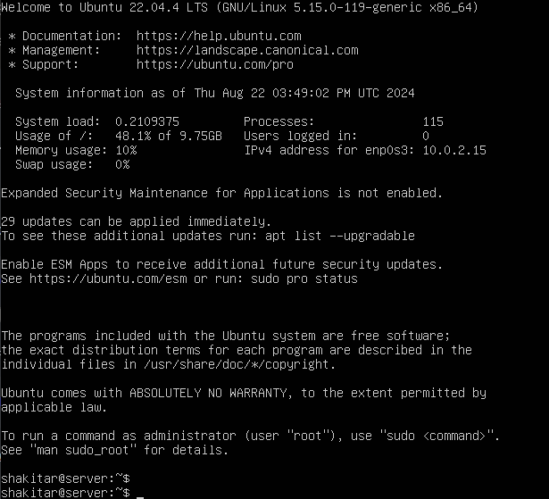 

### Скачать и установить на виртуальную машину **gitlab-runner**

> Был выбран метод установки gitlab-runner через [бинарный файл с официального сайта](https://docs.gitlab.com/runner/install/linux-manually.html)

Нужно загрузить бинарный файл <br>
```sh
sudo curl -L --output /usr/local/bin/gitlab-runner "https://s3.dualstack.us-east-1.amazonaws.com/gitlab-runner-downloads/latest/binaries/gitlab-runner-linux-amd64"
```

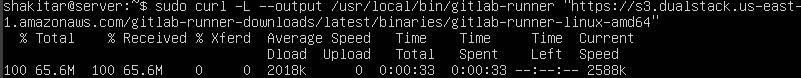 

Даём файлу разрешение на исполнение: <br>
```sh
sudo chmod +x /usr/local/bin/gitlab-runner
```
 
Создаём пользователя GitLab CI <br>
```sh
sudo useradd --comment 'GitLab Runner' --create-home gitlab-runner --shell /bin/bash
```
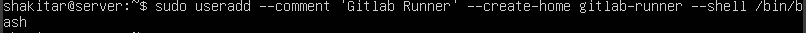 

Установить как службу <br>
```sh
sudo gitlab-runner install --user=gitlab-runner --working-directory=/home/gitlab-runner
```
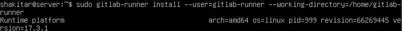 

Запустить службу
```sh
sudo gitlab-runner run
```
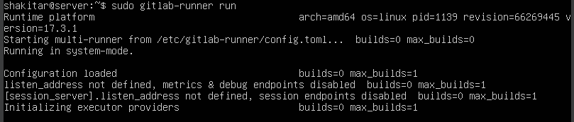 

### Запустить **gitlab-runner** и зарегистрировать его для использования в текущем проекте (*DO6_CICD*)


- Зарегистрировать gitlab-runner
```ssh
sudo gitlab-runner register
```
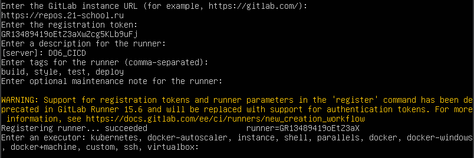 
> Для этого необходимо ввести данные при регистрации: <br>
> 1. Cвой URL-адрес GitLab
> 2. Cвой регистрационный токен
> 3. Название раннера
> 4. Теги для заданий, разделенные запятыми
> 5. Тип исполнителя

<br>


## Part 2. Сборка

### Напиcать этап для CI по сборке приложений из проекта *C2_SimpleBashUtils*

- В корне репозитория создать файл `.gitlab-ci.yml`

```ssh
touch .gitlab-ci.yml
```

- Добавить в файл этап запуска сборки через мейк файл из проекта C2.

> Настроим также этап, чтобы файлы, полученные после сборки (артефакты), сохранялись со сроком хранения 30 дней.

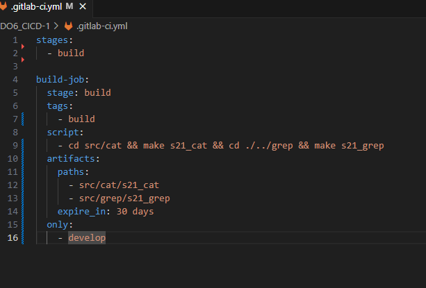

### Неподготовленная оболочка

- При пуше мы столкнемся со следующей ошибкой

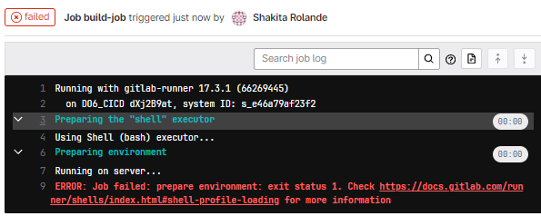

> Раннер нас предупреждает, что среда не подготовлена к запуску. Причиной послужила дефолтная конфигурация gitlab-runner, производящая очистку терминала при выходе из оболочки shell. Комментирование строк данного скрипта устраняет данную ошибку

- Закомментируем строки в `/home/gitlab-runner/.bash_logout`

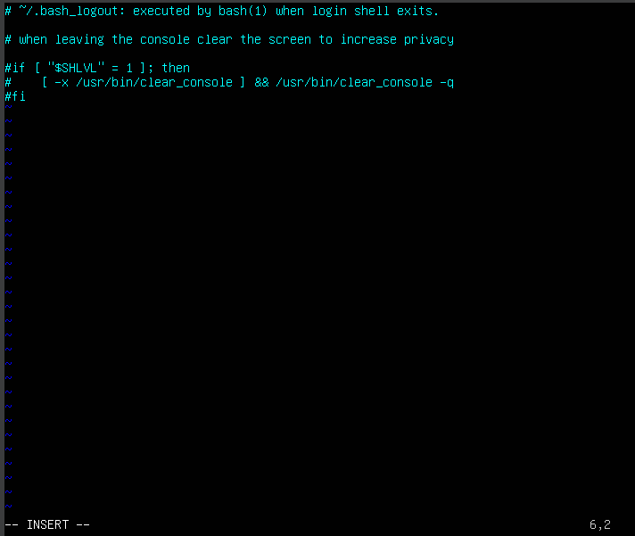

### Проверка сборки проекта

- Перезапустим пайплайн и проверим пропала ли ошибка

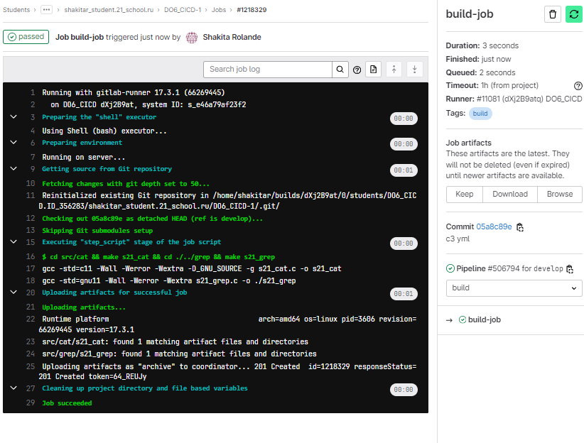

<br>


## Part 3. Тест кодстайла

### Напиcать этап для CI, который запускает скрипт кодстайла (clang-format)

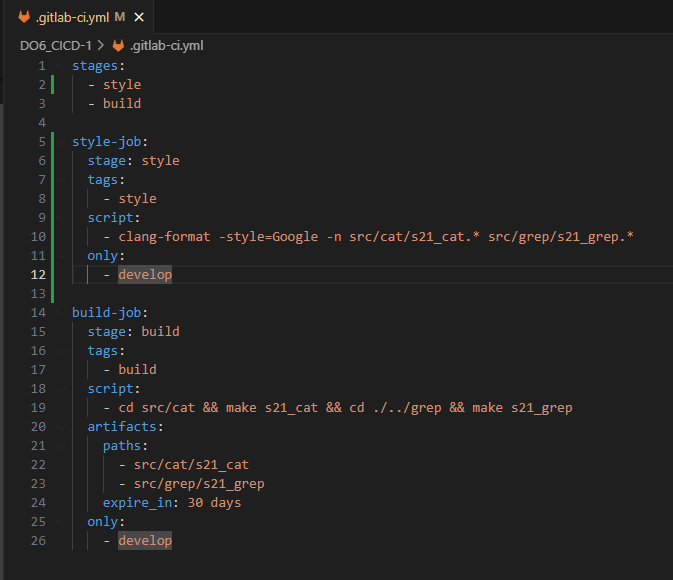

### Проверить зафейлился ли пайплайн, если совершена ошибка в кодстайле


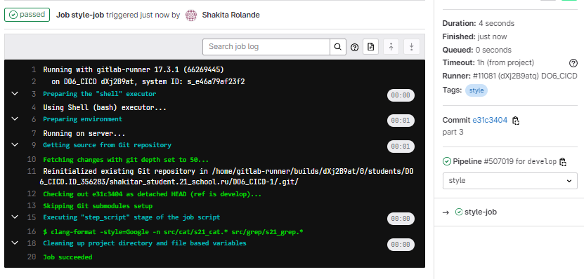


Теперь проект успешно проходит тест кодстайла


<br>


## [Part 4. Интеграционные тесты](#содержание)

### Написать этап для CI, который запускает интеграционные тесты из того же проекта

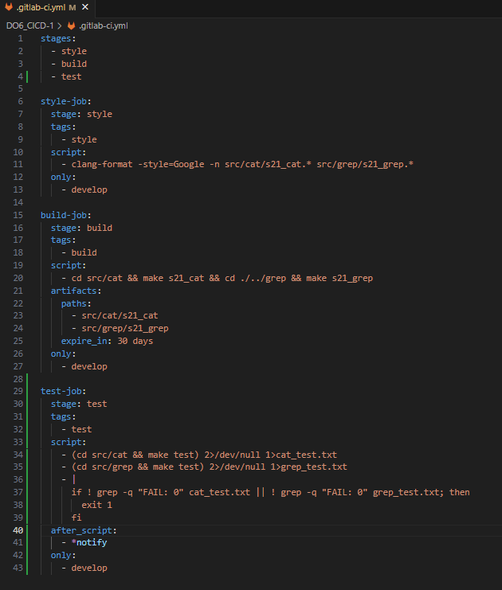

### Проверить зафейлился ли пайплайн, если обнаруживаются ошибочные рузльтаты интеграционных тестов


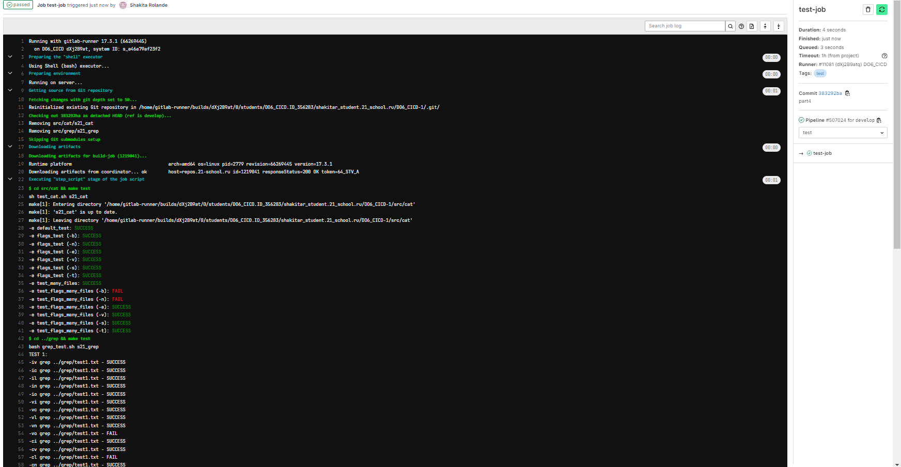

Результат работы пайплайна

Проект успешно проходит интеграционные тесты

<br>


## Part 5. Этап деплоя

### Поднять вторую виртуальную машину Ubuntu Server 22.04 LTS

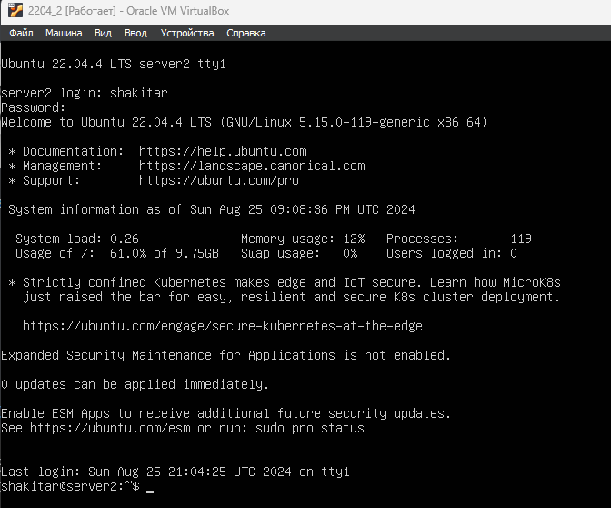

### Статическая маршрутизация между двумя машинами

- Настроим адаптеры обоих машин на внутреннюю сеть

> Для удобства раннеровская машина находится в сети с десктопной версией Ubuntu. В дальнейшем консоли обеих машин будут отображаться на десктопной версии

```sh
sudo vim /etc/netplan/00-network-manager-all.yaml
```

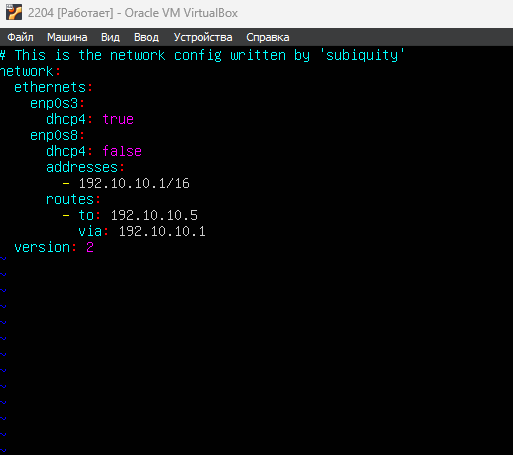
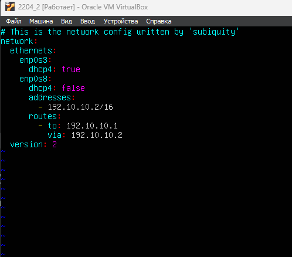

- Обязательно принимаем изменения в настройках адаптеров

```sh
sudo netplan apply
```

- Проверим соединение между машинами

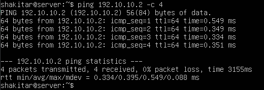
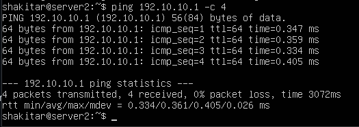

### Генерация ssh-ключей

- Для начала сгенерируем пары ключей для каждой машины

```sh
ssh-keygen
```
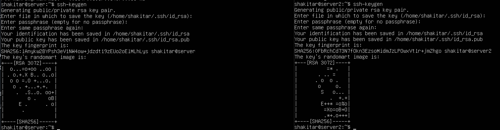

- Добавим открытый ключ второй машины с вывода `cat /home/shakitar/.ssh/id_rsa.pub` в ssh ключи gitlab для работы с проектом на удаленной машине

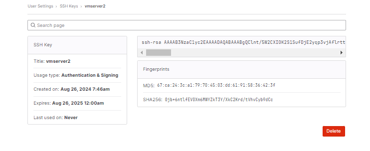

### Написать bash-скрипт, который при помощи ssh и scp копирует файлы, полученные после сборки (артефакты), в директорию /usr/local/bin второй виртуальной машины

> Данная часть предполагает создание отдельного скрипта и применение его в стейдже. Так как ранее все скрипты были описаны в `.gitlab-ci.yml`, то, пожалуй, сохраним данную тенденцию, дабы не засорять репозиторий ничем иным. <br>
> Технически команды yml исполняет bash, поэтому будем считать, что "был написан bash-скрипт". <br>

### Написать этап для CD, который «разворачивает» проект на другой виртуальной машине

> Данный этап будет запускаться вручную при условии, что все предыдущие этапы прошли успешно

- Теперь, когда на удаленной машине есть проект, допишем этап деплоя в `.gitlab-ci.yml`

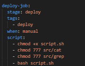

> Этап деплоя описан таким образом, что для получения доступа к удаленному серверу применяется ssh-агент. Для его работы необходимо будет выполнить определенный ряд действий

- После пуша обновленного `gitlab-ci.yml` проверяем состояние пайплайна
(во время deploy нужно запускать вручную)


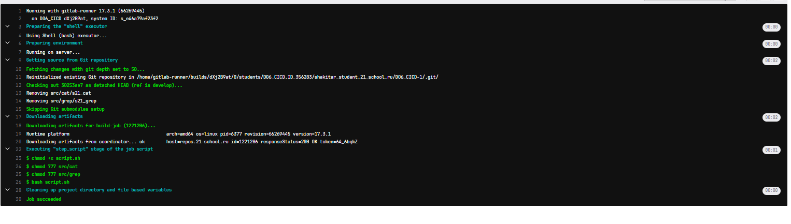

deploy успешно работает

<br>


## Part 6. Дополнительно. Уведомления

### Настроить уведомления о успешном/неуспешном выполнении пайплайна через бота с именем «shakitar DO6 CI/CD» в Telegram

> Текст уведомления будет содержать информацию об успешности прохождения как этапа CI, так и этапа CD. <br>
> В остальном текст уведомления может быть произвольным.

- Найдем в телеграме через поиск `BotFather`
- Запустим бота и напишем `/newbot`

- имя бота `shakitar DO6 CI/CD» в Telegram` <br>
- юзернейм для бота (имя должно быть уникальным и заканчиваться на `bot`)

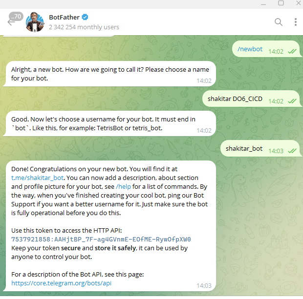

- Теперь найдем бота `getmyid_bot` и напишем ему `/start` для получения нашего `ID`

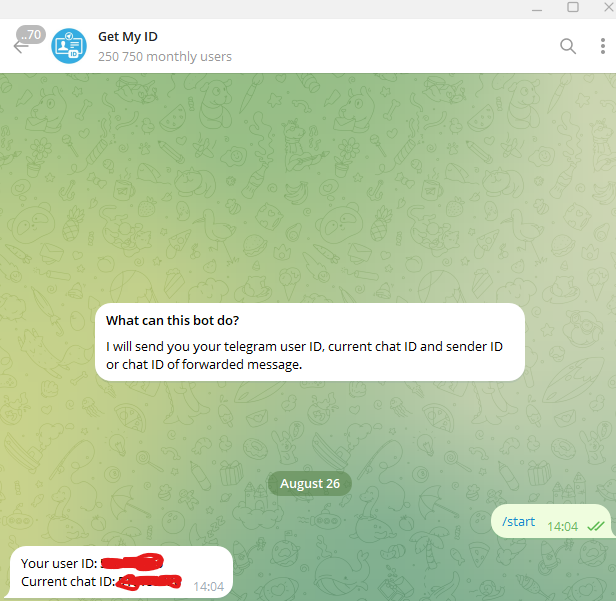

> добавляем в `gitlab-ci.yml` after_script

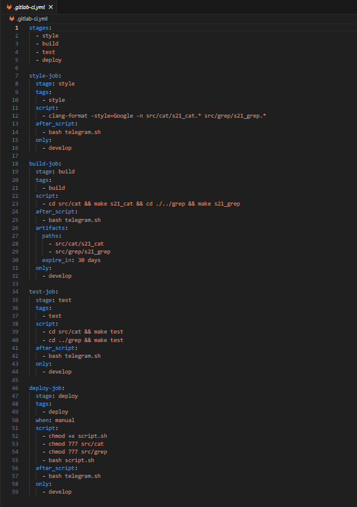

запускаем нашего бота и обновляем пайплайн

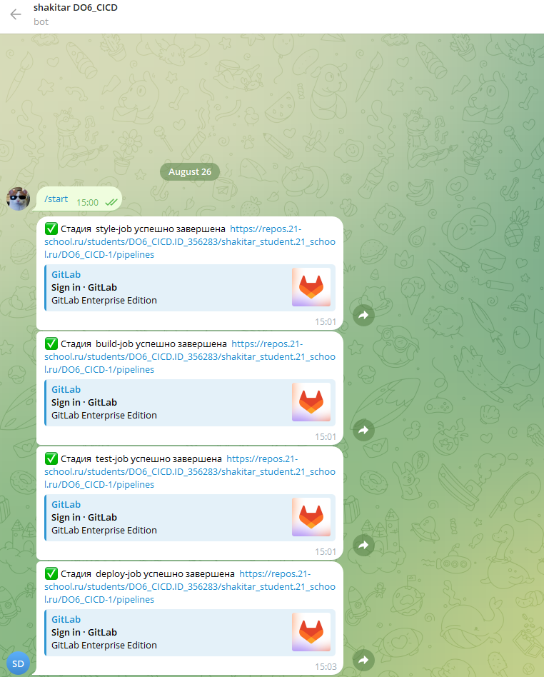


